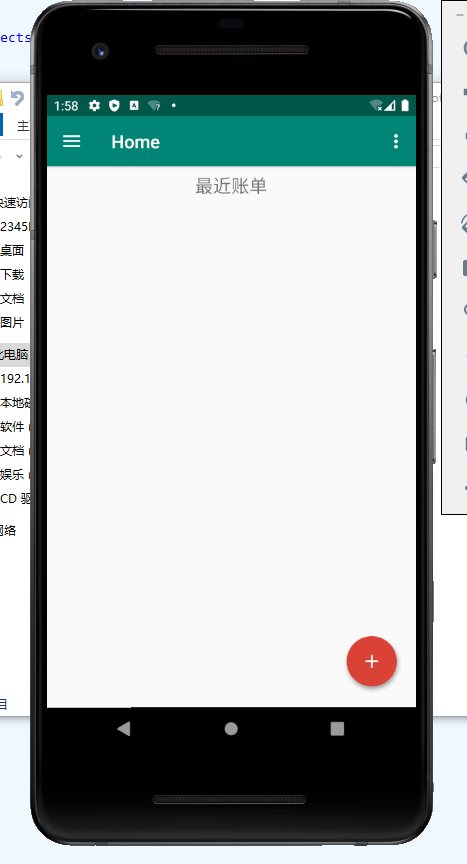
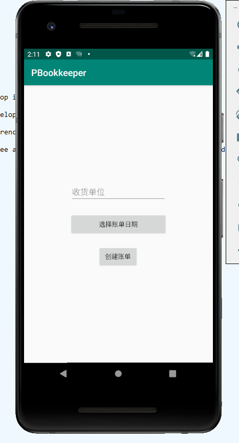

# PBookkeeper
An app for bookkeeping

## Features
[Click me](https://github.com/7emotions/PBookkeeper/projects/1)

## Requirement

This is an examples bill.

As you can see,the arguments I need is following:

1. Receive Unit,
2. Bill`s Date,
3. List of Bill(json string is also allowed)

## UI Instructions
To help you understand my code easily,I wrote this to show you what I have done and how many functions I have realized.

This is Home layout

The layout files it includes are following:

1. layout/activity_main.xml
2. layout/content_main.xml
3. layout/app_bar _main.xml
4. layout/nav_header _main.xml
5. layout/fragment_home.xml

The Java files are:

1. team.paradise.pbookkeeper.ui.home.HomeFragment.java
2. team.paradise.pbookkeeper.ui.home.HomeViewModel.java
3. team.paradise.pbookkeeper.MainActivity.java

At the right of the ToolBar is a option menu,I haven`t develop it.I plan to improve settings.

At the left of the ToolBar is a NavigationView,I haven`t develop it,either.

There is a Frgment under the ToolBar.I plan to show the rencent bills here.And user click each item,he or she will get a summary of the item.The user can edit,delete and share it as well. 

At the bottom is a FloatingButton.After clicking it,you can see a sub button named 'New',that`s all now.Click it and you will see a layout like this:

The layout file it includes is following:

1. activity_add _bill.xml

The java file is:

1. team.paradise.pbookkeeper.AddBillActivity.java

The widgets the layout have and their funciton is following:

1. EditText	(id:recv_unit)	: user will input receive unit here
2. Button	(id:bill_date)	: user will pick the date of the bill
3. Button	(id:create_bill): After clicking it, an activity which is EditBillActivity will be started

EditBillActivity`s UI is following:

The layout files it includes are following:

1. activity_edit _bill.xml
2. content_edit _bill.xml
3. bill_dialog.xml
4. edit_bill _item.xml

The java file is :

1. team.paradise.pbookkeeper.EditBillActivity.java

At the top is a ToolBar.There a menu at its right.
Following is what the menu has:

	<?xml version="1.0" encoding="utf-8"?>
	<menu
    	xmlns:android="http://schemas.android.com/apk/res/android">

	    <item
        android:id="@+id/save"
        android:title="@string/save_bill" />	
	</menu>

However,the function which is saving data hasn`t been realized by me.

If you click the FloatingButton,the dialog that can create a item of the list,which is in the content_edit _bill.xml will show you.

After submitting the dialog, you can see what you just submitted.Try sliding it to the left,you can see two buttons.Yes,a button is used to edit the bill item and another is to delete the bill item.

Attention!There is a bug,which is when you edit the bill item,comment will get a null object.Please help me fix it.What I want is that user can select multiple items to delete.Also,I`d like to ask you to realize the function which is automatic calculation.

As for the following Java files:

1. team.paradise.pbookkeeper.BillItem.java
2. team.paradise.pbookkeeper.MyItemAdapter.java

They are a class of a bill item and a adapter class,which extends BaseAdapter, of List that is in team.paradise.pbookkeeper.EditBillActivity.java

I suggest you creating a class of a bill, which includes bill item`s array ,receive unit and date of bill.
Then I can store data via it.

> !!!BEST COOPERATION!!!